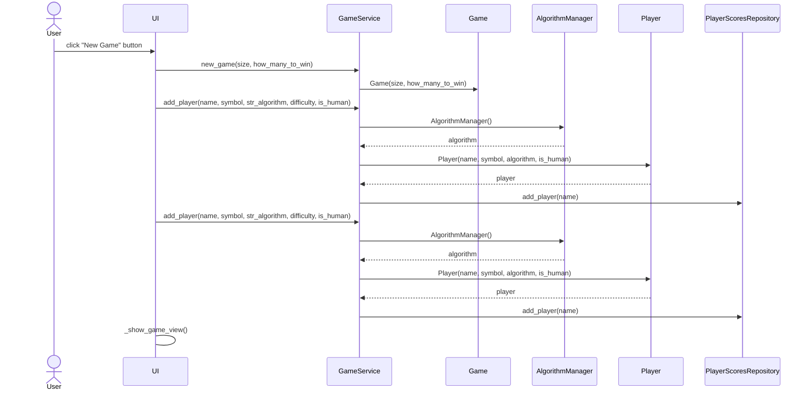

# Arkkitehtuurikuvaus

## Rakenne
Koodin pakkausrakenne on seuraava

Pakkaus **ui** sisältää käyttöliittymästä vastaavan koodin. **Services** sisältää *GameService* luokan joka tarjoaa rajapinnan käyttöliittymälle. *GameService* luokka pyörittää peliä luomalla **entities** pakkauksessa olevat oliot ja välittämällä niille käskyt. **Algoritms** pakkauksessa on eri algoritmit joiden perusteella pelaajat päättävät mitä siirtoja tehdä. Ideana on että muut voivat laajentaa ohjelmistoa tekemällä omia algoritmeja ja laittamalla ne tähän pakkaukseen. **Repositories** pakkauksessa on luokka *PlayerScoresRepository* jonka kautta luetaan ja kirjoitetaan pelaajien pelitilastoja tietokantaan.

**Entities** pakkauksessa luokka
- *Game* ylläpitää tietoa pelin tilasta: missä ruudussa on mikäkin symboli (tai tyhjä ruutu) ja siltä voi kysyä onko peli loppunut, onko joku voittanut pelin ja missä voittava rivi on. Sille myöskin kerrotaan mihin ruutuun laitetaan seuraava symboli.
- *Player* kuvastaa pelaajaa. Siltä kysytään pelaajan seuraavaa siirtoa. Player luokka välittää pyynnön siihen liitettyyn algoritmiin joka palauttaa ko. pelaajan seuraavan siirron. Erikoisalgoritmi *Human* kysyy siis käyttäjältä mikä seuraava siirto pitäisi olla. Muut algoritmit päättävät jollain logiikalla minkä siirron tietokonepelaajan pitäisi tehdä.
- *AlgorithmManager* ylläpitää listaa kaikista eri algoritmeista. Ideana on että ohjelmistoa voi laajentaa luomalla itse erilaisia algoritmeja joiden perusteella tietokone päätää mitä tehdä. Jokaiseen *Player* luokan olioon liitetään siis yksi algoritmi joka vuorollaan päättää minkä siirron ko. pelaajan pitäisi tehdä. Erikoisalgoritmina on *Human* jolla kysytään ihmis-käyttäjältä mitä pitäisi seuraavaksi tehdä.

**Algorithms** pakkauksessa luokka
- *Human* on algoritmi joka kysyy käyttäjältä mikä ruutu pitäisi valita
- *Uniform* on algoritmi joka arpoo tasajakaumalla jonkin vapaana olevan ruudun johon laittaa seuraava merkki.
- *Valuebased* on algoritmi joka laskee vapaina oleville ruuduille arvot niiden pysty-, vaaka- ja diagonaali akseleilla olevien peräkkäisten merkkien määrien perusteella ja valitsee ruudun jolla on korkein arvo.

**Repositories** pakkuksessa luokka
- *PlayerScoresRepository* lukee ja kirjoittaa voitto, tappio ja tasapelitilastoja tietokantaan. Tietokanta johon kirjoitetaan määritellään .env ja .env.test tiedostoissa erikseen varsinaisia pelejä ja testausta varten.

Pelin logiikasta vastaavien luokkien välistä yhteyttä kuvaa seuraava luokkakaavio

## Päätoiminnallisuudet
Alla on kuvattu sekvenssikaaviolla uuden pelin käynnistämisen tapahtumakulku kahdelle pelaajalle
### New Game

