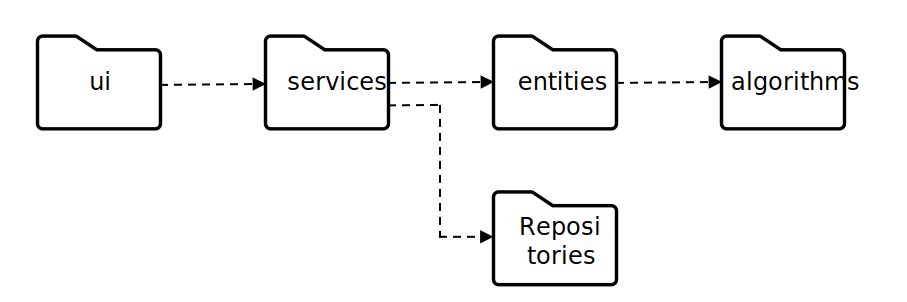
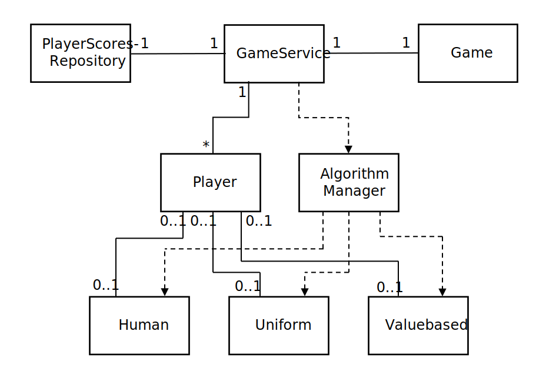

# Arkkitehtuurikuvaus

## Rakenne
Koodin pakkausrakenne on seuraava

Pakkaus **ui** sisältää käyttöliittymästä vastaavan koodin. **Services** sisältää -luokan joka tarjoaa rajapinnan käyttöliittymälle. -luokka pyörittää peliä luomalla **entities** pakkauksessa olevat oliot ja välittämällä niille käskyt. **Algoritms** pakkauksessa on eri algoritmit joiden perusteella pelaajat päättävät mitä siirtoja tehdä. Ideana on että muut voivat laajentaa ohjelmistoa tekemällä omia algoritmeja ja laittamalla ne tähän pakkaukseen. **Repositories** pakkauksessa on luokka  jonka kautta luetaan ja kirjoitetaan pelaajien pelitilastoja tietokantaan.

**Entities** pakkauksessa luokka
-  ylläpitää tietoa pelin tilasta: missä ruudussa on mikäkin symboli (tai tyhjä ruutu) ja siltä voi kysyä onko peli loppunut, onko joku voittanut pelin ja missä voittava rivi on. Sille myöskin kerrotaan mihin ruutuun laitetaan seuraava symboli.
-  kuvastaa pelaajaa. Siltä kysytään pelaajan seuraavaa siirtoa. -luokka välittää pyynnön siihen liitettyyn algoritmiin joka palauttaa ko. pelaajan seuraavan siirron. Erikoisalgoritmi  kysyy siis käyttäjältä mikä seuraava siirto pitäisi olla. Muut algoritmit päättävät jollain logiikalla minkä siirron tietokonepelaajan pitäisi tehdä.
-  ylläpitää listaa kaikista eri algoritmeista. Ideana on että ohjelmistoa voi laajentaa luomalla itse erilaisia algoritmeja joiden perusteella tietokone päätää mitä tehdä. Jokaiseen  luokan olioon liitetään siis yksi algoritmi joka vuorollaan päättää minkä siirron ko. pelaajan pitäisi tehdä. Erikoisalgoritmina on  jolla kysytään ihmis-käyttäjältä mitä pitäisi seuraavaksi tehdä.

**Algorithms** pakkauksessa luokka
-  on algoritmi joka kysyy käyttäjältä mikä ruutu pitäisi valita
-  on algoritmi joka arpoo tasajakaumalla jonkin vapaana olevan ruudun johon laittaa seuraava merkki.
-  on algoritmi joka laskee vapaina oleville ruuduille arvot niiden pysty-, vaaka- ja diagonaali akseleilla olevien peräkkäisten merkkien määrien perusteella ja valitsee ruudun jolla on korkein arvo.

**Repositories** pakkauksessa luokka
-  lukee ja kirjoittaa voitto, tappio ja tasapelitilastoja tietokantaan. Tietokanta johon kirjoitetaan määritellään  ja  tiedostoissa erikseen varsinaisia pelejä ja testausta varten.

Pelin logiikasta vastaavien luokkien välistä yhteyttä kuvaa seuraava luokkakaavio

## Käyttöliittymä
Käyttöliittymä sisältää viisi eri näkymää ja **quit** toiminnallisuuden.
-   näyttää itse pelin tilanteen, eli ruudukon ja siinä olevat merkit
-   näkymässä määritetään pelin parametrit kuten laudan koko ja pelaajat
-  näkymässä valitaan tallennettu tiedosto ja ladataan siitä pelin tilanne
-  kirjoittaa pelin tilanteen tiedostoon
-  näyttää tietokannasta pelaajien voittotilastot

-luokka vastaa näkymien näyttämisestä. -luokan olio välitetään aina kulloinkin aktiivisena olevalle näkymälle joka joko kysyy tältä pelin statukseen liittyviä tietoja tai välittää sille tehtävät muutokset, kuten uuden merkin lisäämistä valittuun ruutuun.

## Sovelluslogiikka
-luokka tarjoaa siis rajapinnan käyttöliittymälle pelin pelaamiseksi. Metodi
- `new_game` alustaa uuden pelin annetun kokoisella laudalla ja tiedolla montako tarvitaan peräkkäin voittoon
- `add_player` lisää uuden pelaajan annetulla pelisymbolilla, algoritmilla ja mahdollisella nimellä. Metodi lisää pelaajan myös voittotilastokantaan jos se on ihmispelaaja kutsumalla -luokkaan liitettyä  oliota.
- `add_move_and_get_updates` tarkistaa -luokan oliolta onko siirto sallittu, sitten käskee tätä lisäämään siirron jonka jälkeen tarkistetaan loppuiko peli ko. siirtoon. Tämän jälkeen kutsutaan metodia `make_computer_moves_and_get_updates` jolla käydään läpi tietokonepelaajien siirtoja niin kauan kunnes peli loppuu tai tulee ihmispelaajan vuoro tehdä siirto. Metodi palauttaa kaikki nämä siirrot käyttöliittymälle joka tietää korostaa ko. ruudut kun renderöi päivitetyn pelinäkymän

## Tietojen pysyväistallennus
Ohjelma tallentaa pysyväistietoja kahteen paikkaan: pelaajien voittotilastoja tietokantaan, sekä tallennettuja pelejä käyttäjän nimeämiin tekstitiedostoihin. Voittotilastojen suhteen noudatetaan repository-suunnittelumallia jossa luokka  vastaa tietojen lukemisesta ja kirjoittamisesta -tiedostossa määritettyyn tietokantaan PlayerScores tauluun. Testien tapauksessa tietokanta on määritetty -tiedostossa.

Pelin tallennuksessa käyttäjä määrittelee -näkymässä tiedoston nimen johon pelin tilanne tallennetaan, joka sitten kutsuu  luokan metodia `save` annetulla tiedostonimellä. Tämä kirjoittaa kaikki pelin tilannetiedot (pelaajien tiedot, ruuduissa olevat pelimerkit) ulkoiseen tekstitiedostoon jossa tiedot ovat eritettynä "§" merkillä. Pelin lataaminen tapahtuu vastaavasti -näkymässä lukemalla käyttjän määrittelemä tiedosto sisään ja asettamalla siinä oleva pelitilanne voimaan.

## Päätoiminnallisuudet
Alla on kuvattu sekvenssikaavioilla muutama keskeinen toiminnallisuus: uuden pelin alustaminen ja ihmiskäyttäjän tekemä häviävä siirto tietokonepelaajaa vstaan

### Uusi peli
Alla on kuvattu sekvenssikaaviolla uuden pelin käynnistämisen tapahtumakulku kahdelle pelaajalle

Käyttäjä painaa  näkymässä "Start" painiketta jolloin kenttiin kirjoitetut tiedot luetaan ja välitetään  oliolle. Tämä siis alustaa pelin ja lisää pelaajat peliin ja voittotietokantaan jos ne puutuvat sieltä, jonka jälkeen laitetaan pelinäkymä  näkyville.

### Ihminen tekee häviävän siirron tietokonepelaajaa vastaan
Alla on kuvattu tapahtumankulkua kun ihmispelaaja tekee siirron jonka jälkeen -algoritmilla toimiva tieotkonepelaaja tekee voittavan siirron.

Kun käyttäjä on painanun jonkin ruudun nappia, painetun ruudun numero välitetään  oliolle joka kysyy ensiksi -oliolta onko siirto sallittu jonka jälkeen se käskee tätä päivittämään siirron peliin. Tämän jälkeen tartkistetaan onko peli ohi, ja kun se ei ole, kysytään seuraavalta pelaajalta onko se ihmispelaaja. Koska tämä ei ole, niin kutsutaan tämän pelaajan metodia `next_move` joka puolestaan kysyy siihen liitetyltä algoritmilta mikä ruutu valitaan seuraavaksi ja palauttaa tämän tiedon. Jälleen katsotaan onko peli ohi. Koska tietokoneen tekemä siirto oli voittava, niin se on. Tällöin lähdetään käymään läpi kaikkia pelissä olevia pelaajia ja päivittämään niiden voitto tai tappiotiedot tietokantaan jos ko. pelaajat ovat ihmisiä. Tietokantapäivitykset tapatuvat -olion välityksellä. Käyttäjän tekemä siirto ja kaikkien tietokonepelaajien tekemät siirrot sen jälkeen palautetaan käyttöliittymälle. Käyttöliittymä kysyy  oliolta seuraavaksi vuorossa olevan pelaajan symbolia onko peli ohi
