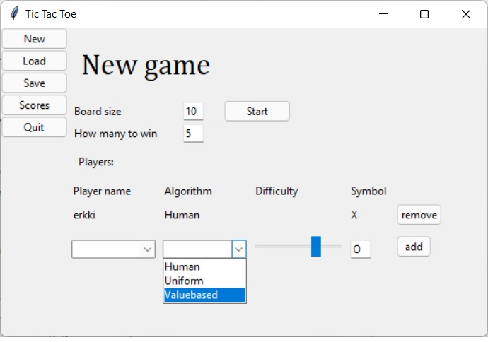
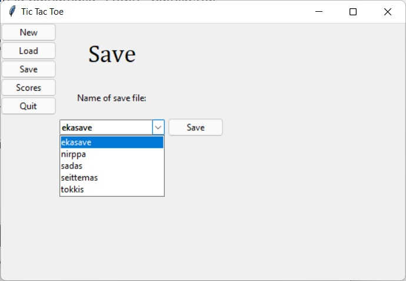
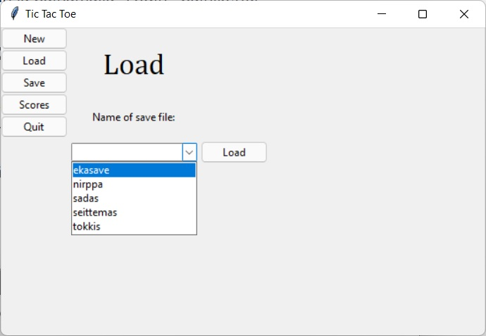

# Käyttöohje

Lataa ohjelman viimeisin 

## Konfigurointi
Voittotilastot tallentuvat -tiedostossa määriteltyyn tietokantaan \data\ nimiseen kansioon. Pelien tallennus tapahtuu \saves\ nimiseen kansioon. Nämä polut määrietetään -tiedostossa.

## Ohjelman asennus ja käynnistäminen

Mene ohjelman kansioon ja asenna riippuvuudet komennolla
```
poetry install
```

Kun riippuvuudet on kertaalleen asennettu, ohjelman voi käynnistää komentoriviltä komennolla
```
poetry run invoke start
```

Ohjelma luo itse tarvittavan tietokannan

## Pelin aloittaminen
Peli käynnistyy voittotilastonäkymään. Siirry **New Game** näkymään. aseta ruudukon koko sekä tieto montako pitää saada poeräkkäin voittoon. Lisää pelaajat peliin. Ihmis pelaajille voi antaa nimen jolloin järjestelmä pitää kirjaa tämän voitoista, tappioista ja tasapeleistä. Merkitse pelaajan pelisymboli, esim "X" vastaavaan symbolikenttään. Paina lopuksi **add** nappia jolloin pelaaja tulee lisätyksi. Voit sitten lisätä muite pelaajia jotta ei tarvitse pelata yksin. Algorithms alasvetovalikosta voi valita tietokonevastustajien käyttämää algoritmia, ja difficulty mittarista niiden vaikeustason jos ko. algoritmi sellaista tukee. Nämä lisätään myös **add** nappulasta. Pelaajat voidaan poistaa pelistä **remove** nappulasta. Kun pelaajat ja pelilaudan koko on asetettu, peli voidaan käynnistää **start** nappulasta.



## Pelin pelaaminen
Peliä pelataan painamalla haluttuua ruutua. Peli näyttää korostetulla vimmeisimmät tietokonepelaajien tekemät siirrot sekä pelin loputtua voittavan rivin.


## Pelin tallentaminen
Peli voidaan tallentaa siirtymällä **save** näkymään ja antamalla talletettavalle pelille nimi tai vaihtoehtoisesti tallentamalla aiemmin talletetun pelin päälle. Annettuasi nimi pelille, paina **Save** nappia.


## Pelin lataaminen
Tallennetun pelin voi ladata **Load** näkymästä. Valitse tallennettu peli alasvetovalikosta tai kirjoita se, ja paina sitten **Load**-nappia.


## Pelitulosten tarkasteleminen
Siirry **Scores** näkymään tarkastelemaan pelaajien voittotilastoja.

## Ohjelman lopettaminen
Ohjelman voi lopettaa **Quit** painikkeesta.
