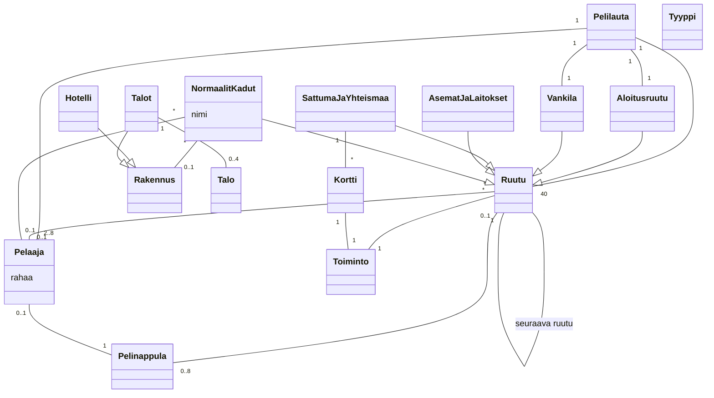

```mermaid
 classDiagram
      Pelilauta "1" -- "40" Ruutu
	  Ruutu "0..1" -- "0..8" Pelinappula
	  Pelaaja "0..1" -- "1" Pelinappula
	  Pelilauta "1" -- "2..8" Pelaaja
	  Ruutu "" -- "1" Ruutu: seuraava ruutu
	  Ruutu "*" -- "1" Toiminto
	  SattumaJaYhteismaa "1" -- "*" Kortti
	  Kortti "1" -- "1" Toiminto
	  Ruutu "*" -- "0..1" Pelaaja
	  Aloitusruutu "" --|> "" Ruutu
	  Vankila "" --|> "" Ruutu
	  SattumaJaYhteismaa "" --|> "" Ruutu
	  AsematJaLaitokset "" --|> "" Ruutu
	  NormaalitKadut "" --|> "" Ruutu
	  Pelilauta "1" -- "1" Aloitusruutu
	  Pelilauta "1" -- "1" Vankila
	  NormaalitKadut "*" -- "0..1" Pelaaja
	  NormaalitKadut "*" -- "0..1" Rakennus
	  Hotelli "" --|> ""Rakennus
	  Talot "" --|> "" Rakennus
	  Talot "1" -- "0..4" Talo
      class Pelilauta{

      }
      class Ruutu{
	  
      }
	  class Aloitusruutu{
	  
	  }
	  class Vankila{
	  
	  }
	  class SattumaJaYhteismaa{
	  
	  }
	  class AsematJaLaitokset{
	  
	  }
	  class NormaalitKadut{
		nimi
	  }
	  class Rakennus{
	  
	  }
	  class Hotelli{
	  
	  }
	  class Talot{
	  
	  }
	  class Talo{
	  
	  }
	  class Pelinappula{

      }
	  class Pelaaja{
		rahaa
      }
	  class Toiminto{
	  
	  }
	  class Kortti{
	  
	  }
	  class Tyyppi{
	  
	  }
```
